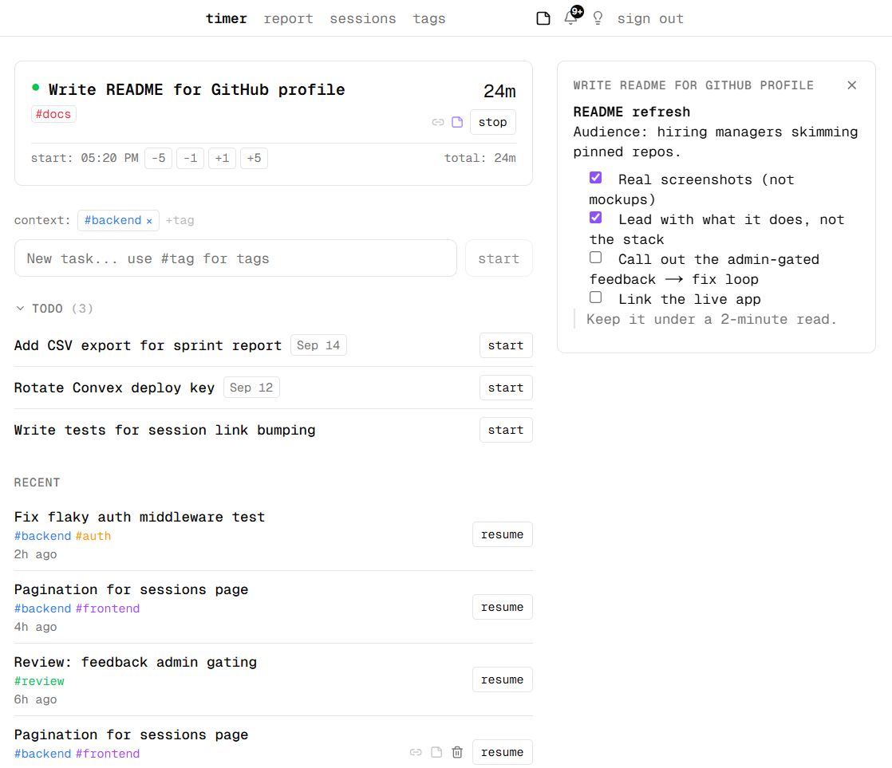
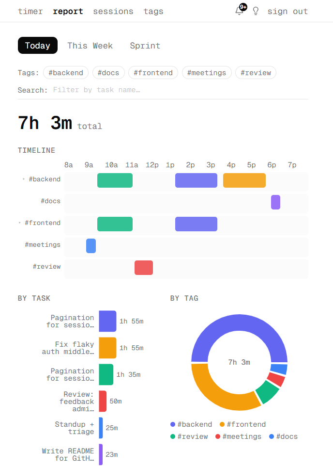
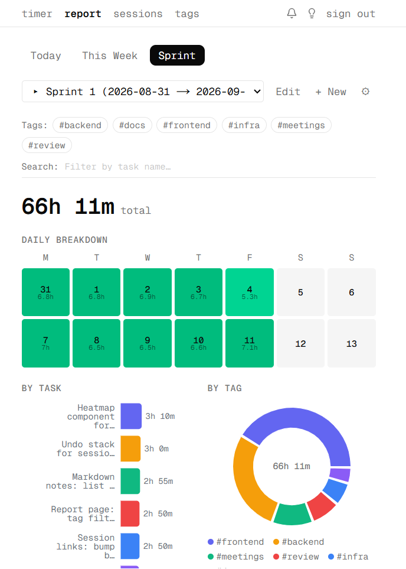
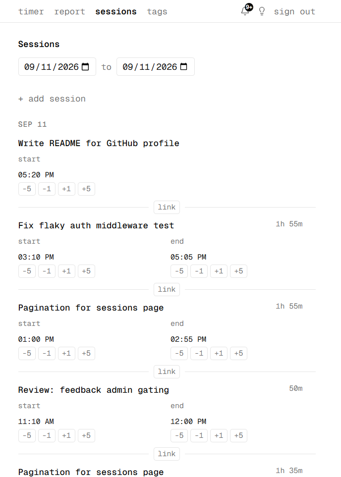
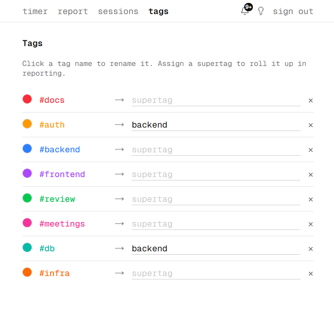
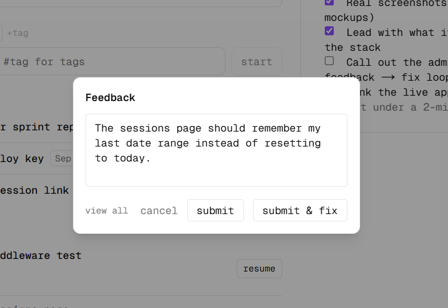
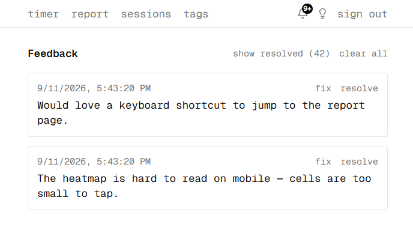
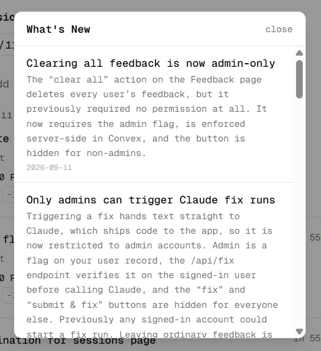

# Time Keeper

A personal time tracker that gets out of your way. Type what you're working on, hit **start**, and keep going. Tags come from hashtags inside the task name, and the app rolls everything up into daily timelines, sprint heatmaps, and an editable session history.

**Live app:** <https://time-keeper-pink.vercel.app> · **Stack:** Next.js 16 · React 19 · Convex · Tailwind v4 · Vercel



> All screenshots are captured from the deployed app on a demo account.

## Why it exists

Most time trackers make you set up projects and categories before you can log a minute. Time Keeper inverts that: the task name *is* the data model. `Fix OAuth callback race #backend #auth` creates the task, extracts the tags, and starts the clock in one keystroke. Structure — colors, hierarchy, sprints — is layered on afterwards, once you know what you actually want to see.

It is also a small, real production app I use every day, with other users, a real deploy pipeline, and a real feedback loop. That makes it a useful testbed for how I build and ship software.

## What it does

### Track

- **One-key timer.** Start a task and it runs. Start the next one and the previous session stops automatically; the two are *linked*, so nudging one boundary moves the other.
- **Hashtag tags.** Tags are parsed from the task name, color-coded, and used everywhere. A **context bar** pins tags that get appended to every new task (keep `#backend` on all afternoon).
- **Lifetime totals.** The active timer shows the current session and the task's total across every session.
- **Markdown notes.** Every task has a notes pane (sidebar on desktop, inline on mobile) with live preview and list continuation on Enter.
- **Todo queue.** Queue tasks with optional dates, promote one to the timer with a click, or mark it done without starting a timer at all.

### Report

| Today | Sprint |
|---|---|
|  |  |

- **Today / This Week / Sprint** views with a per-tag timeline, weekly and sprint heatmaps, time-by-task bars, and a time-by-tag donut.
- **Filter** by any combination of tags or by task name; every chart updates live.
- **Sprints** are defined once as a cadence (pattern length + anchor date) and detected automatically. Ad-hoc sprints can be created and edited too.

### Curate

| Sessions | Tags |
|---|---|
|  |  |

- **Editable history.** Nudge any session boundary by ±1 / ±5 minutes, retype a time, change the date, or add a session retroactively. `⌘Z` / `Ctrl+Z` undoes.
- **Tag hierarchy.** Give `#db` and `#auth` the supertag `#backend` and reports roll them up, with the option to expand back down.
- **Tag colors** from a fixed palette so charts stay legible.

## The feedback → fix loop

The part I care most about is how changes get made. Any user can leave feedback from the lightbulb in the nav. Admins get one more button:

| Feedback modal (admin view) | Admin feedback queue |
|---|---|
|  |  |

**submit & fix** hands the feedback text to a [Claude Code](https://claude.com/claude-code) routine that has the repo checked out and follows [`AGENTS.md`](./AGENTS.md): read the feedback, implement the fix, add a changelog entry, run typecheck and lint, ship to `main` (Vercel deploys), then mark the feedback resolved. Users see the result in the **What's New** feed — the bell in the nav badges entries they haven't seen yet.



Because that button can push code to production, it is deliberately locked down:

- **Permission lives in the database.** `users.isAdmin` is a flag on the Convex user document — no email allowlist, no env-var fallback, fail-closed.
- **Enforced server-side.** `/api/fix` resolves the caller's session token and checks the flag before touching the webhook (`401` unauthenticated, `403` not admin). Destructive mutations such as "clear all feedback" call `requireAdmin()` inside Convex, so bypassing the UI does not help.
- **Hidden in the UI.** Non-admins never see `fix`, `submit & fix`, or `clear all`; the controls render only after the admin query resolves `true`, so they do not flash while loading.

## Architecture

```
Browser ──WebSocket──▶ Convex (schema, queries, mutations, auth)
   │                        ▲
   └──HTTP──▶ Next.js route handlers ──┘   (server-side auth checks, fix webhook)

Vercel build: npx convex deploy --cmd 'npx next build'
```

- **[Next.js 16](https://nextjs.org)** App Router on **React 19**; pages are client components subscribed to Convex.
- **[Convex](https://convex.dev)** is the database, server functions, and real-time layer. Every list on screen is a live query, so an edit on one device shows up on another immediately.
- **[Convex Auth](https://labs.convex.dev/auth)** with password and GitHub providers; the `users` table is extended with the `isAdmin` flag.
- **Tailwind CSS v4**, **shadcn/ui**, **Radix**, **Lucide**, **Recharts**.
- **Vercel** runs `npx convex deploy --cmd 'npx next build'`, so schema, functions, and frontend ship together.

Where to look:

| | |
|---|---|
| `convex/schema.ts` | Data model: tasks, sessions, session links, sprints, tag hierarchy and colors, feedback, `users.isAdmin` |
| `convex/sessions.ts` | Timer logic: auto-stop, linked boundaries, manual sessions, time adjustments |
| `convex/admin.ts` | `isAdmin` / `requireAdmin` helpers and the `isCurrentUserAdmin` query |
| `src/app/api/fix/route.ts` | Admin-gated bridge to the Claude Code fix routine |
| `src/app/report/`, `src/components/report/` | Timeline, heatmap, and chart components |
| `src/lib/changelog.ts` | Source of the What's New feed |
| `AGENTS.md` | Conventions for humans and agents working in the repo |

## Running it locally

You need a Convex deployment; there is no mock backend.

```bash
npm install
npx convex dev     # first run: log in, pick or create a project, writes .env.local
npm run dev        # in a second terminal
```

Open <http://localhost:3000>. Leave `npx convex dev` running; it watches `convex/` and redeploys on save. Use the password provider to sign up locally, or set `AUTH_GITHUB_ID` / `AUTH_GITHUB_SECRET` for GitHub sign-in.

To make yourself an admin, set `isAdmin: true` on your row in the Convex dashboard (**Data → users**). The fix button additionally needs `CLAUDE_FIX_WEBHOOK_URL` and `CLAUDE_FIX_WEBHOOK_SECRET`.

| Script | |
|---|---|
| `npm run dev` | Next.js dev server |
| `npx convex dev` | Convex dev server |
| `npm run build` | `tsc --noEmit` + production build |
| `npm run lint` | ESLint |

## Contributing

Conventions live in [`AGENTS.md`](./AGENTS.md): ship complete work straight to `main`, keep `convex/_generated/` in sync, add a What's New entry for every user-visible change, and resolve the feedback that prompted it.

## License

[MIT](./LICENSE)
