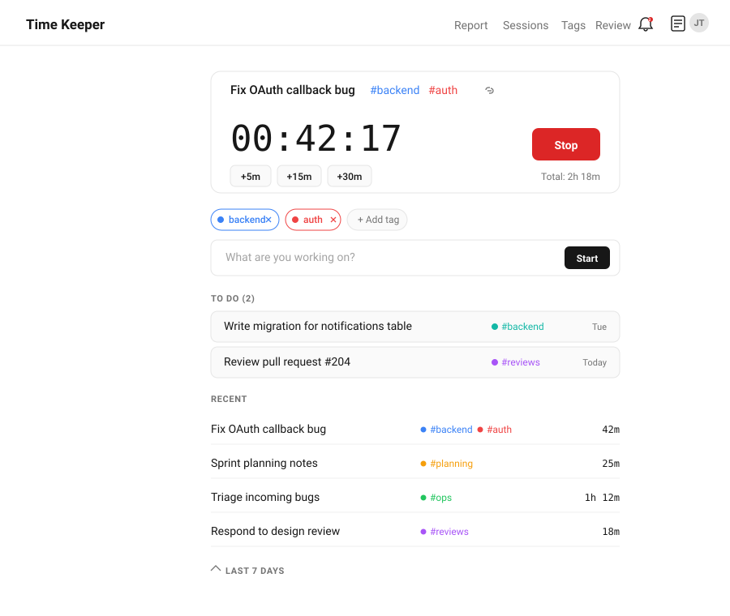
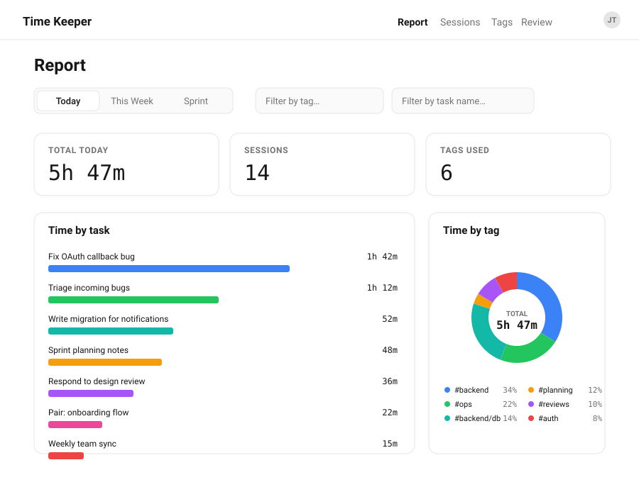
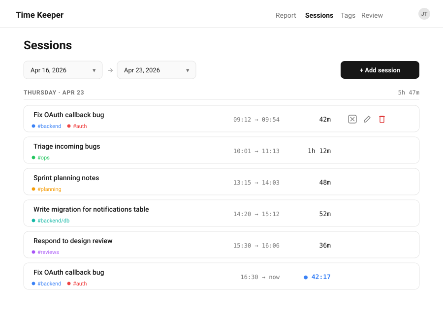

# Time Keeper

A personal time tracker that gets out of your way. Type what you're working on, hit start, and keep going. Tags come from hashtags inside the task name, and the app rolls everything up into reports, sprints, and editable session history.

Live app: <https://time-keeper-pink.vercel.app>



> Screenshots in this README are illustrative mockups of the real UI, not live captures.

## What it does

- **One-click timer.** Start a task, it runs. Start the next task, the previous one stops automatically and the two sessions are linked so bumping one edge moves the other.
- **Hashtag-driven tags.** Type `Fix OAuth callback bug #backend #auth` and the tags are extracted, color-coded, and usable everywhere. An **active tags bar** lets you pin tags that get appended to every new task.
- **Tag hierarchy.** Give a tag a supertag (e.g. `#backend/db → #backend`) and reports roll subtags up automatically.
- **Todo queue.** Queue tasks with optional scheduled dates, mark them done without starting a timer, or promote them to the active timer with one click.
- **Editable sessions.** Bump the active timer by ±5 / 15 / 30 minutes, or open a session on the Sessions page and edit its start, end, date, tags, or task name. Undo with `⌘Z` / `Ctrl+Z`.
- **Markdown notes.** Every task has a notes pane (sidebar on desktop, inline on mobile) with live markdown preview.
- **Reports.** Today / This Week / Sprint tabs, with bar charts of time-per-task, a donut of time-per-tag, a daily timeline, and a weekly/sprint heatmap. Filter by tag or task name.
- **Sprints.** Define a sprint cadence once (pattern length + anchor date) and the report picks up the current sprint automatically.
- **What's New feed.** Bell icon in the nav shows a badge for changelog entries you haven't seen yet.
- **Feedback widget.** Submit feedback from inside the app; an agent picks it up and ships the fix.





## Tech stack

- **[Next.js 16](https://nextjs.org)** (App Router) on **React 19**
- **[Convex](https://convex.dev)** for the database, server functions, and real-time sync
- **[Convex Auth](https://labs.convex.dev/auth)** with password + GitHub providers
- **Tailwind CSS v4**, **shadcn/ui**, **Radix UI**, **Lucide icons**
- **Recharts** for the charts
- Deployed on **Vercel**

Notable files:

- `src/app/page.tsx` — home view (active timer + queue + recent)
- `src/app/report/page.tsx` — reports
- `src/app/sessions/page.tsx` — editable session history
- `src/app/tags/page.tsx` — tag colors and hierarchy
- `convex/schema.ts` — data model (tasks, sessions, session links, sprints, tag hierarchy, tag colors)
- `src/lib/changelog.ts` — the What's New feed

## Running it locally

You need a Convex deployment to run the app — there is no mock backend.

```bash
# 1. install
npm install

# 2. provision a dev Convex deployment (first run only)
#    this creates .env.local with CONVEX_DEPLOYMENT + NEXT_PUBLIC_CONVEX_URL
npx convex dev

# 3. in a second terminal, start Next.js
npm run dev
```

Open <http://localhost:3000>. The first `npx convex dev` run walks you through logging in to Convex and picking a project; leave it running in the background — it watches `convex/` and redeploys functions on save.

If you want GitHub sign-in locally, set `AUTH_GITHUB_ID` and `AUTH_GITHUB_SECRET` in `.env.local`. Otherwise use the password provider from the sign-in page.

### Scripts

| | |
|---|---|
| `npm run dev` | Next.js dev server on `:3000` |
| `npx convex dev` | Convex dev server (watches and redeploys `convex/`) |
| `npm run build` | Type-check (`tsc --noEmit`) + production Next build |
| `npm run lint` | ESLint |
| `npm start` | Serve the production build |

### Deploying

Vercel runs `npx convex deploy` (pushes schema + functions to the linked Convex deployment) followed by `npx next build`. Set `CONVEX_DEPLOY_KEY` in the Vercel project so the deploy step can authenticate.

## Contributing

See [`AGENTS.md`](./AGENTS.md) for the conventions agents and humans follow in this repo — branch policy, `_generated/` hygiene, feedback workflow, and What's New entries.
